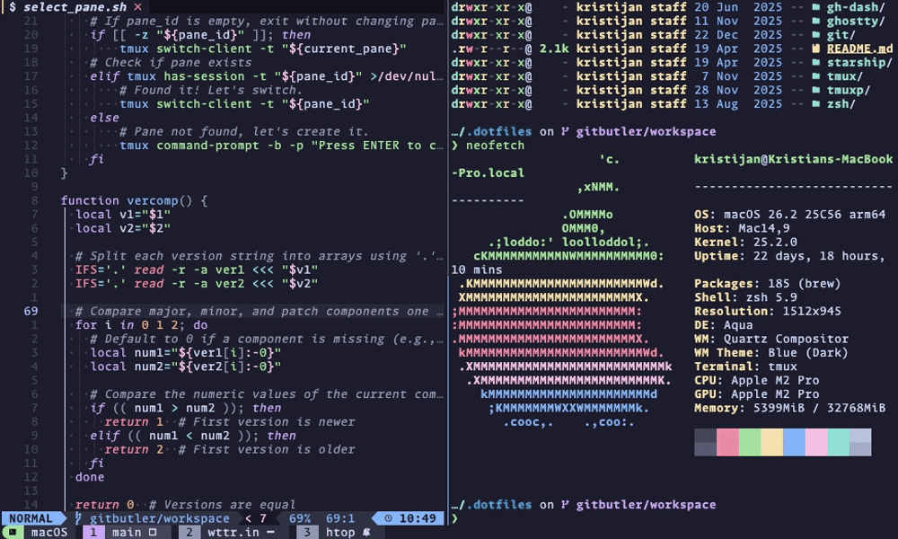

<h1 align="center">
    🔀 TMUX FZF Pane Switch
</h1>



Switch to any TMUX pane, in any session, by searching and filtering using fzf.

Search and filter on any pane details, such as (but not limited to) the `#{window_name}`, `#{pane_title}`, or `#{pane_current_command}"`. If a pane cannot be found using the search criteria, the plugin will offer to create a new window in the current session.

## Requirements

* [fzf](https://github.com/junegunn/fzf) >= 0.53.0 (requires the `--tmux` option). I tested with 0.55.0.
* [tmux](https://github.com/tmux/tmux) >= 3.3. I tested with 3.3a.

> [!NOTE]
> To get the border styling as shown in the image above, you need fzf version >= 0.58.0.

## Installation

### Using TPM (recommended)

1. Install [TPM (Tmux Plugin Manager)](https://github.com/tmux-plugins/tpm).

2. Add `tmux-fzf-pane-switch` to your `~/.tmux.conf`:

    ```bash
    set -g @plugin 'kristijan/fzf-pane-switch.tmux'
    ```

3. Start tmux and install the plugin.

    Press `<tmux_prefix> + I` (capital i, as in Install) to install the plugin.

    Press `<tmux_prefix> + U` (capital u, as in Update) to update the plugin.

### Manual installation

1. Clone this repository to your desired location:

    ```bash
    git clone https://github.com/kristijan/fzf-pane-switch.tmux.git ~/.tmux/plugins/fzf-pane-switch.tmux
    ```

2. Add the following to your `~/.tmux.conf`:

    ```bash
    run-shell ~/.tmux/plugins/fzf-pane-switch.tmux/select_pane.tmux
    ```

    Any customisation variables should be set **BEFORE** the `run-shell` line so they're correctly sourced.

    For example:

    ```bash
    set -g @fzf_pane_switch_list-panes-format "session_name window_name pane_title pane_current_command"
    run-shell ~/.tmux/plugins/fzf-pane-switch.tmux/select_pane.tmux
    ```

3. Reload your tmux configuration:

    ```bash
    tmux source-file ~/.tmux.conf
    ```

## Customise

You can override the following options in your `tmux.conf` file.

### Key binding

```bash
set -g @fzf_pane_switch_bind-key "key binding"
```

Default is `prefix + s`, which replaces the tmux default session select (tmux default: `choose-tree -Zs -O name`)

### fzf window position

```bash
set -g @fzf_pane_switch_window-position "position"
```

Default is `center,70%,80%`. You can use any options allowed [https://man.archlinux.org/man/fzf.1.en#tmux](https://man.archlinux.org/man/fzf.1.en#tmux).

### fzf pane preview

```bash
set -g @fzf_pane_switch_preview-pane "[true|false]"
```

Default is `true`

### fzf pane preview position

Only when `@fzf_pane_switch_preview-pane` is `true`.

```bash
set -g @fzf_pane_switch_preview-pane-position "position"
```

Default is `right,,,nowrap`. You can use any options allowed [https://man.archlinux.org/man/fzf.1.en#preview~3](https://man.archlinux.org/man/fzf.1.en#preview~3).

### tmux list-panes format

This is the output format of `tmux list-panes` that you see in the fzf window. You can use this to match on other tmux formats.

```bash
set -g @fzf_pane_switch_list-panes-format "FORMATS"
```

Default is `pane_id session_name window_name pane_title pane_current_command`.

> [!TIP]
> You can use any tmux FORMAT option allowed [https://www.man7.org/linux/man-pages/man1/tmux.1.html#FORMATS](https://www.man7.org/linux/man-pages/man1/tmux.1.html#FORMATS). String manipulation should also work. For example, the `pane_id` by default is shown with a leading percent symbol (e.g. `%3`). You can remove this by setting `set -g @fzf_pane_switch_list-panes-format "s/%//:pane_id session_name window_name pane_title pane_current_command"`

## Tools used in demonstration

* TMUX theme is [catppuccin](https://github.com/catppuccin/tmux) mocha.
* ZSH shell prompt is [starship](https://starship.rs)
* `fzf` theme is [catppuccin](https://github.com/catppuccin/fzf) mocha.

## Inspiration

I pretty much retrofitted the [brokenricefilms/tmux-fzf-session-switch](https://github.com/brokenricefilms/tmux-fzf-session-switch) TPM plugin. So, if you're looking for something to switch tmux sessions only, go check it out.

## Other plugins

Check out my other plugin [TMUX Flash Copy](https://github.com/Kristijan/flash-copy.tmux), that enables you to search visible words in the current tmux pane, then copy that word to the system clipboard by pressing the associated label key.
